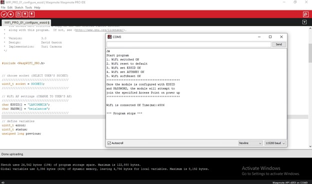
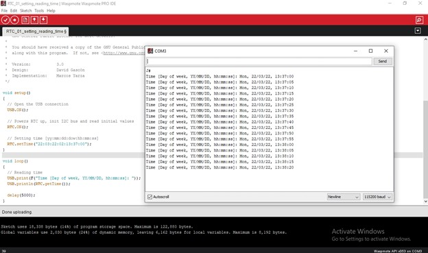
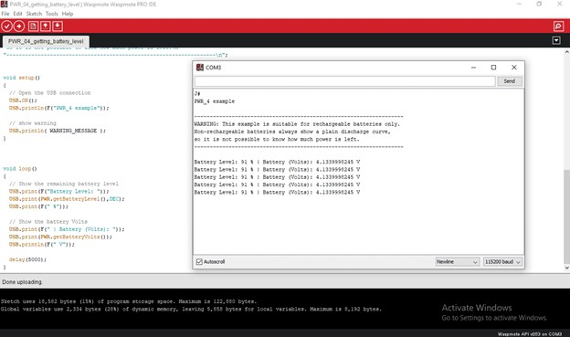
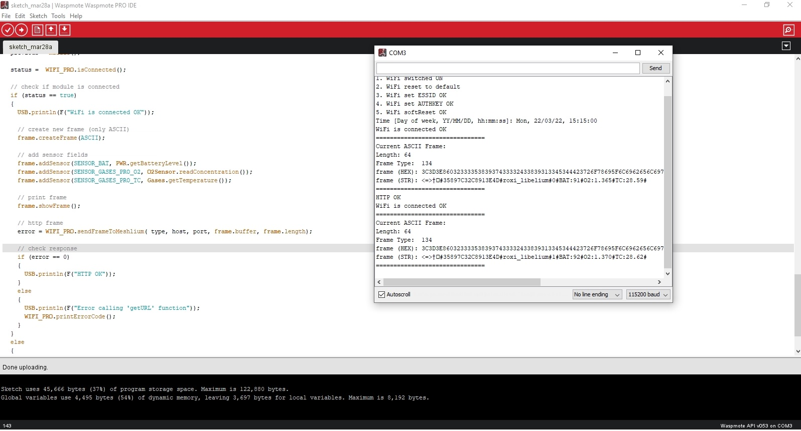
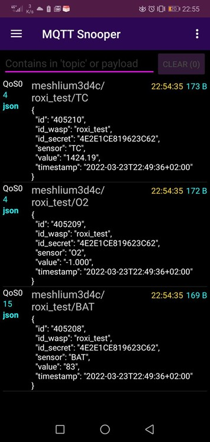
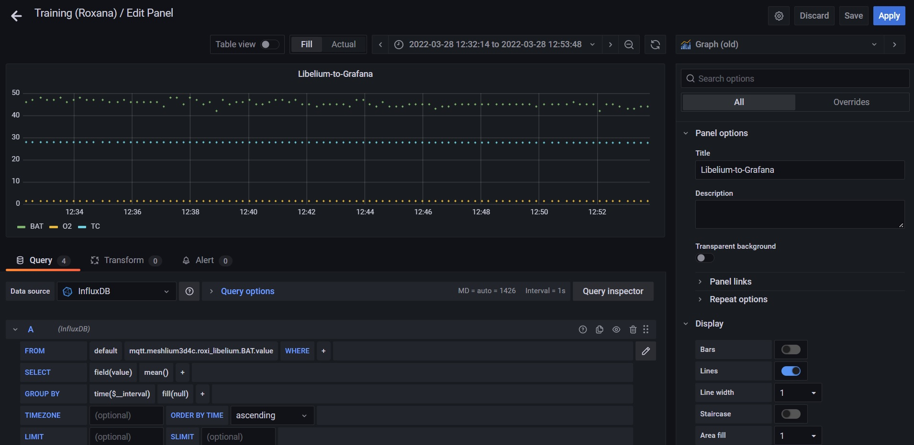

# Libelium_Practical_Test
<b>
Board: Smart Gases v30 

Communication: WiFi PRO Module 
</b>

<h3>1. WiFi ESSID communication</h3>
In order to send data to a web server located on the Internet, a connection must be established using the WiFi PRO module. For this we have to provide in the code the network name and the password (for security, I replaced the credentials with '*'). The code for this configuration:
```
#include <WaspWIFI_PRO.h>

uint8_t socket = SOCKET0;

char ESSID[] = "libelium_AP";
char PASSW[] = "password";

uint8_t error;
uint8_t status;
unsigned long previous;

void setup() 
{
  if (WIFI_PRO.ON(socket) == 0)
  {    
    USB.println(F("1. WiFi switched ON"));
  }
  else
  {
    USB.println(F("1. WiFi did not initialize correctly"));
  }

  if (WIFI_PRO.resetValues() == 0)
  {    
    USB.println(F("2. WiFi reset to default"));
  }
  else
  {
    USB.println(F("2. WiFi reset to default ERROR"));
  }

  if (WIFI_PRO.setESSID(ESSID) == 0)
  {    
    USB.println(F("3. WiFi set ESSID OK"));
  }
  else
  {
    USB.println(F("3. WiFi set ESSID ERROR"));
  }

  if (WIFI_PRO.setPassword(WPA2, PASSW) == 0)
  {    
    USB.println(F("4. WiFi set AUTHKEY OK"));
  }
  else
  {
    USB.println(F("4. WiFi set AUTHKEY ERROR"));
  }

  if (WIFI_PRO.softReset() == 0)
  {    
    USB.println(F("5. WiFi softReset OK"));
  }
  else
  {
    USB.println(F("5. WiFi softReset ERROR"));
  }

}

void loop()
{ 
  previous = millis();

  if (WIFI_PRO.isConnected() == true)
  {    
    USB.print(F("WiFi is connected OK"));
  }
  else
  {
    USB.print(F("WiFi is connected ERROR")); 
  }
}
```

<p align = "center"></p>
<br>

####2. RTC time
Real-time clock (RTC) is used to measure time even when the main device is powered off.
```
void setup()
{
  USB.ON();
  RTC.ON();
  
  RTC.setTime("13:01:11:06:12:33:00");
}

void loop()
{
  USB.print(F("Time [Day of week, YY/MM/DD, hh:mm:ss]: "));
  USB.println(RTC.getTime());
  
  delay(5000); 
}
```

<p align = "center"></p>
<br>

####3. Battery Level
```
void setup()
{
  USB.ON();
}

void loop()
{
  USB.print(F("Battery Level: "));
  USB.print(PWR.getBatteryLevel(),DEC);
  USB.print(F(" %"));
  
  USB.print(F(" | Battery (Volts): "));
  USB.print(PWR.getBatteryVolts());
  USB.println(F(" V"));
  
  delay(5000);
}

```
<p align = "center"></p>
<br>

####4. Temperature and gas concentration data 
```
#include <WaspSensorGas_v30.h>
#include <WaspFrame.h>

O2SensorClass O2Sensor(SOCKET_1);

#define POINT1_PERCENTAGE 0.0    
#define POINT2_PERCENTAGE 5.0  

#define POINT1_VOLTAGE 0.35
#define POINT2_VOLTAGE 2.0

float concentrations[] = {POINT1_PERCENTAGE, POINT2_PERCENTAGE};
float voltages[] =       {POINT1_VOLTAGE, POINT2_VOLTAGE};

char node_ID[] = "roxi_libelium";

float temperature;
float O2Vol;
float O2Con;

void setup()
{
  USB.ON();

  O2Sensor.setCalibrationPoints(voltages, concentrations);
  
  frame.setID(node_ID);  
  
  Gases.ON();
  O2Sensor.ON();
}

void loop()
{
  temperature = Gases.getTemperature();
  O2Vol = O2Sensor.readVoltage();
  O2Con = O2Sensor.readConcentration();

  USB.print(F("Temperature: "));
  USB.print(temperature);
  USB.println(F(" Celsius Degrees |"));
  
  USB.print(F("O2 concentration Estimated: "));
  USB.print(O2Vol);
  USB.println(F(" mV | "));

  USB.print(F(" O2 concentration Estimated: "));
  USB.print(O2Con);
  USB.println(F(" %"));  
  
  frame.createFrame(ASCII, node_ID);
  frame.addSensor(SENSOR_GASES_TC, temperature);
  frame.addSensor(SENSOR_GASES_O2, O2Con); 
  frame.showFrame();
  
  delay(5000);
}

```
<br>

####5. Send data via WiFI to Meshlium 82.78.81.178
```
#include <WaspWIFI_PRO.h>
#include <WaspSensorGas_v30.h>
#include <WaspFrame.h>

uint8_t socket = SOCKET0;

char ESSID[] = "****";
char PASSW[] = "****";

char type[] = "http";
char host[] = "82.78.81.178";
char port[] = "80";

uint8_t error;
uint8_t status;
unsigned long previous;

char moteID[] = "roxi_libelium";

O2SensorClass O2Sensor(SOCKET_1);

#define POINT1_PERCENTAGE 0.0    
#define POINT2_PERCENTAGE 5.0  

#define POINT1_VOLTAGE 0.35
#define POINT2_VOLTAGE 2.0

float concentrations[] = {POINT1_PERCENTAGE, POINT2_PERCENTAGE};
float voltages[] =       {POINT1_VOLTAGE, POINT2_VOLTAGE};

float temperature;  // Stores the temperature in ºC

void setup() 
{
  USB.ON();
  
  // 1. Switch ON the WiFi module
  if (WIFI_PRO.ON(socket) == 0)
  {    
    USB.println(F("1. WiFi switched ON"));
  }
  else
  {
    USB.println(F("1. WiFi did not initialize correctly"));
  }

  // 2. Reset to default values
  if (WIFI_PRO.resetValues() == 0)
  {    
    USB.println(F("2. WiFi reset to default"));
  }
  else
  {
    USB.println(F("2. WiFi reset to default ERROR"));
  }
  
  // 3. Set ESSID
  if (WIFI_PRO.setESSID(ESSID) == 0)
  {    
    USB.println(F("3. WiFi set ESSID OK"));
  }
  else
  {
    USB.println(F("3. WiFi set ESSID ERROR"));
  }

  // 4. Set password key
  if (WIFI_PRO.setPassword(WPA2, PASSW) == 0)
  {    
    USB.println(F("4. WiFi set AUTHKEY OK"));
  }
  else
  {
    USB.println(F("4. WiFi set AUTHKEY ERROR"));
  }

  // 5. Software Reset 
  if (WIFI_PRO.softReset() == 0)
  {    
    USB.println(F("5. WiFi softReset OK"));
  }
  else
  {
    USB.println(F("5. WiFi softReset ERROR"));
  }

  RTC.ON();
  
  RTC.setTime("22:03:22:02:15:15:00");
  
  USB.print(F("Time [Day of week, YY/MM/DD, hh:mm:ss]: "));
  USB.println(RTC.getTime());
  
  O2Sensor.setCalibrationPoints(voltages, concentrations);
  
  Gases.ON();  
  
  O2Sensor.ON();
  
  frame.setID(moteID);  
}

void loop()
{ 
  previous = millis();

  if (WIFI_PRO.isConnected() == true)
  {    
    USB.println(F("WiFi is connected OK"));

    frame.createFrame(ASCII); 

    frame.addSensor(SENSOR_BAT, PWR.getBatteryLevel());
    frame.addSensor(SENSOR_GASES_PRO_O2, O2Sensor.readConcentration());
    frame.addSensor(SENSOR_GASES_PRO_TC, Gases.getTemperature());

    frame.showFrame();  

    error = WIFI_PRO.sendFrameToMeshlium( type, host, port, frame.buffer, frame.length);

    if (error == 0)
    {
      USB.println(F("HTTP OK"));      
    }
    else
    {
      USB.println(F("Error calling 'getURL' function"));
      WIFI_PRO.printErrorCode();
    }
  }
  else
  {
    USB.print(F("WiFi is connected ERROR")); 
  }

  delay(3000); 
}
```
<p align = "center"></p>
<br>

####6. Data transmission checked using MQTT Snooper
The folowing screenshot is from a previous data transmission, on a different board.
<p align = "center"></p>
<br>

####7. Data visualisation - [Grafana Dashboard](https://grafana.beia-telemetrie.ro/d/OwQacm_Gk/training-roxana?orgId=1&from=1648459185319&to=1648461443902)
<p align = "center"></p>

